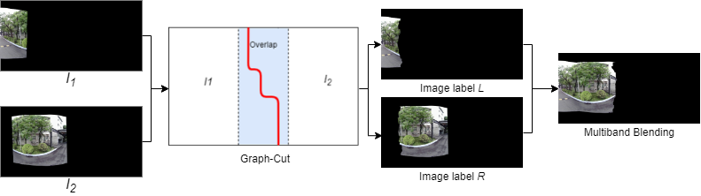
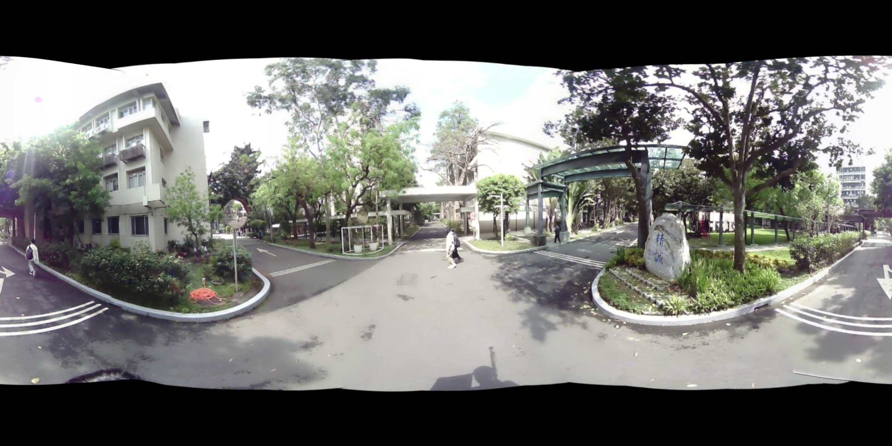
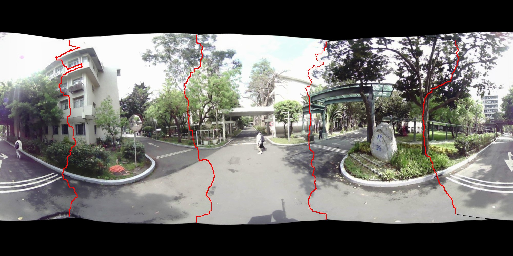

# Graph-Cut
### Platform and Library
platform: Visual Studio 2019

opencv 3.4.0

### GraphCut Overflow


### Result
no seam



with seam



### Input Data Structure
``` bash
.
├── 00000
│   ├── 0.jpg
│   ├── 1.jpg
│   └──  ...
├── 00001
│   ├── 0.jpg
│   ├── 1.jpg
│   └──  ...
├── 00002
│   ├── 0.jpg
│   ├── 1.jpg
│   └──  ...
└── ...
```

### Running and Test:
input folder: ./Release/input/[yourcase]:
```bash
Graphcut.exe [yourcase]
```
### Debug mode:
to turn on debug mode,change isDebug to true in Utils.cpp